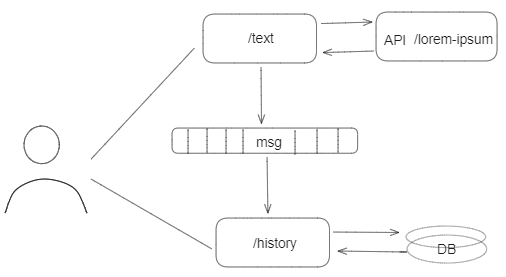

# BetVictor Text Processing System

<h2><u>History Microservice</u></h2>
This microservice is part of the BetVictor Text Processing System. It consumes processed text data from a Kafka topic,
stores it in a PostgreSQL database, and provides an endpoint to retrieve the historical computation results.

For details on how text data is processed and the initial API used to generate this data, please refer to
the [Text Processing Application repository](https://github.com/Artem3/betvictor-text-microservice).

## Architecture

**History Microservice** listens to the Kafka topic `words.processed` and performs the following key operations:

- Consumes messages containing text processing results.
- Stores these results in a PostgreSQL database.
- Provides an HTTP endpoint to fetch the history of results.



### Endpoint Description

- **Endpoint URL**: `/betvictor/history`
- **Method**: HTTP GET
- **Functionality**:
    - Returns the last 10 computation results stored in the database.

## Technologies

- **Java**: Main programming language, version 17.
- **Spring Boot**: Used for creating the REST API and managing Kafka consumers, version 3.2.4.
- **Kafka**: Consumes messages from the `words.processed` topic.
- **Database**: Uses PostgreSQL, specifically the Docker image `postgres:13-alpine`.

## Database Schema

The database schema consists of a single table named `word_metrics` with the following columns:

- `id` (Primary Key)
- `freq_word` (String)
- `avg_paragraph_size` (Double)
- `avg_paragraph_processing_time` (String)
- `total_processing_time` (String)
- `created_at` (Timestamp)

## Setup and Running

Ensure you have Docker installed as the database runs in a Docker container using `docker-compose.yml`. The service
itself can be run locally, depending on your setup preferences.

## Usage

To retrieve the last 10 processing results:

```bash
curl -X GET "http://localhost:8082/betvictor/history"
```

Example JSON Response:

```json
[
  {
    "id": 116,
    "freqWord": "et",
    "avgParagraphSize": 58.4,
    "avgParagraphProcessingTime": "111μs 542ns",
    "totalProcessingTime": "101ms 549μs",
    "createdAt": "2024-04-25T08:41:16.374911Z"
  },
  {
    "id": 115,
    "freqWord": "non",
    "avgParagraphSize": 57.1,
    "avgParagraphProcessingTime": "2ms 122μs",
    "totalProcessingTime": "114ms 521μs",
    "createdAt": "2024-04-25T08:41:04.661449Z"
  },
  ...
]
```